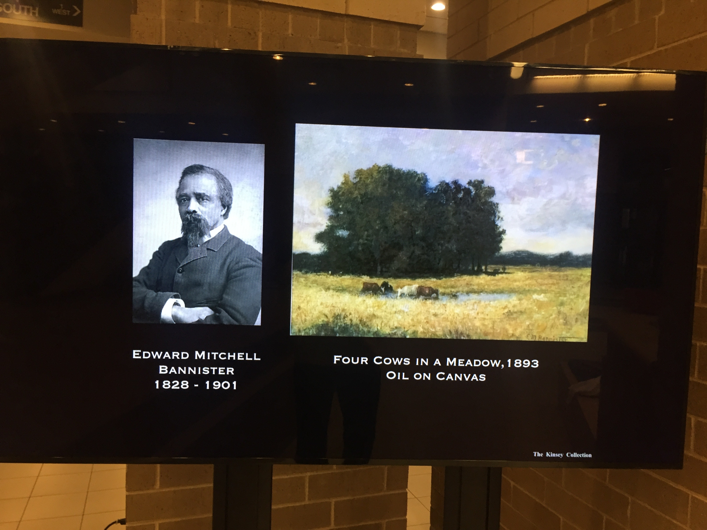
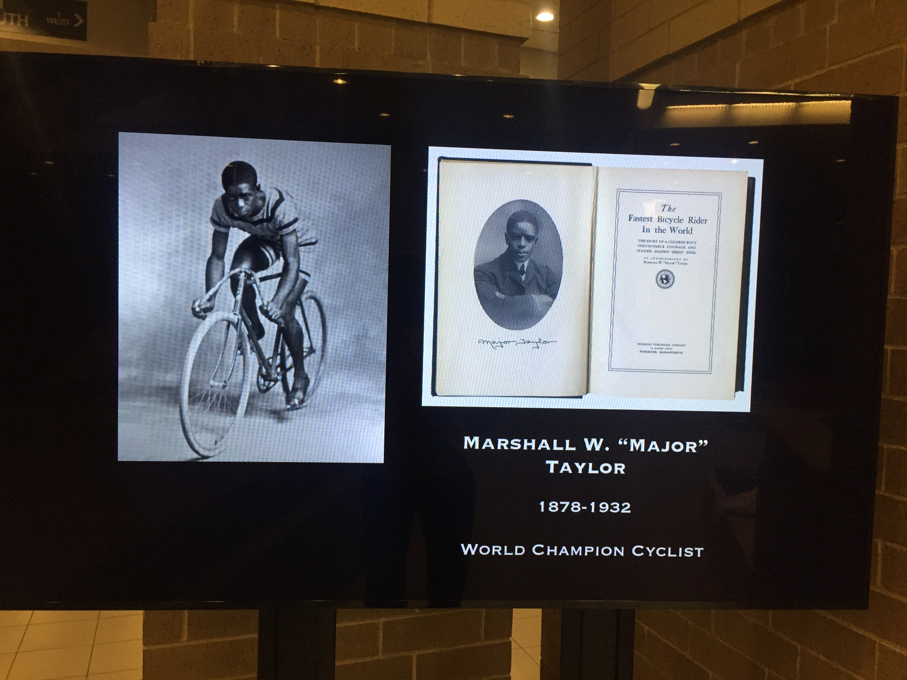
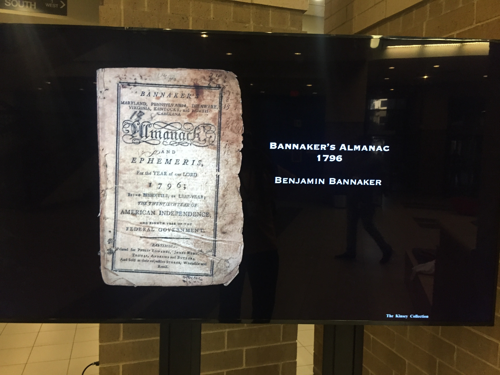
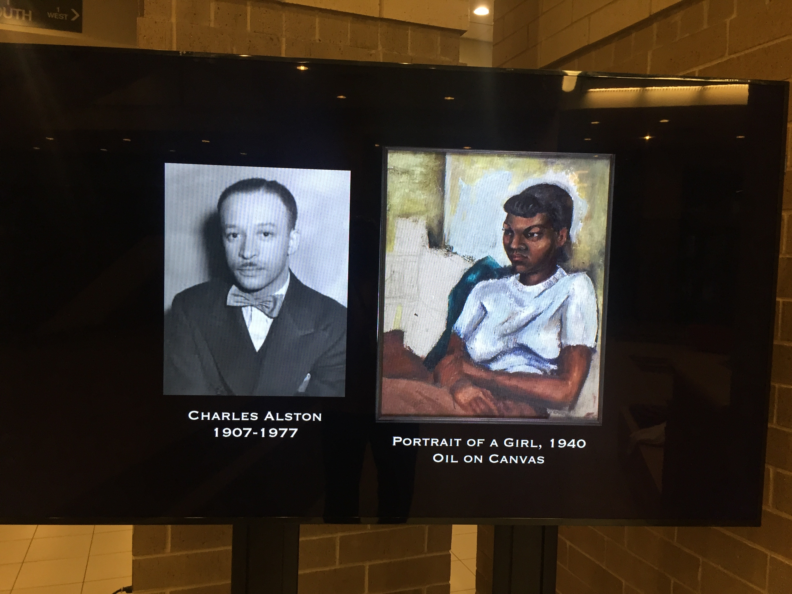
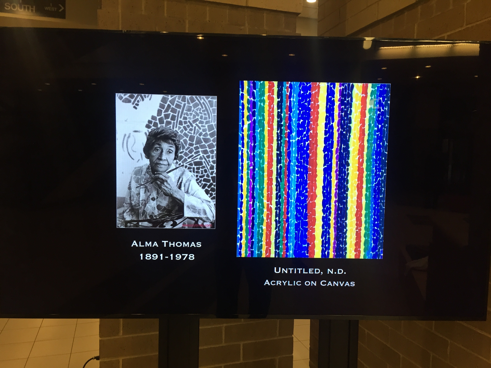
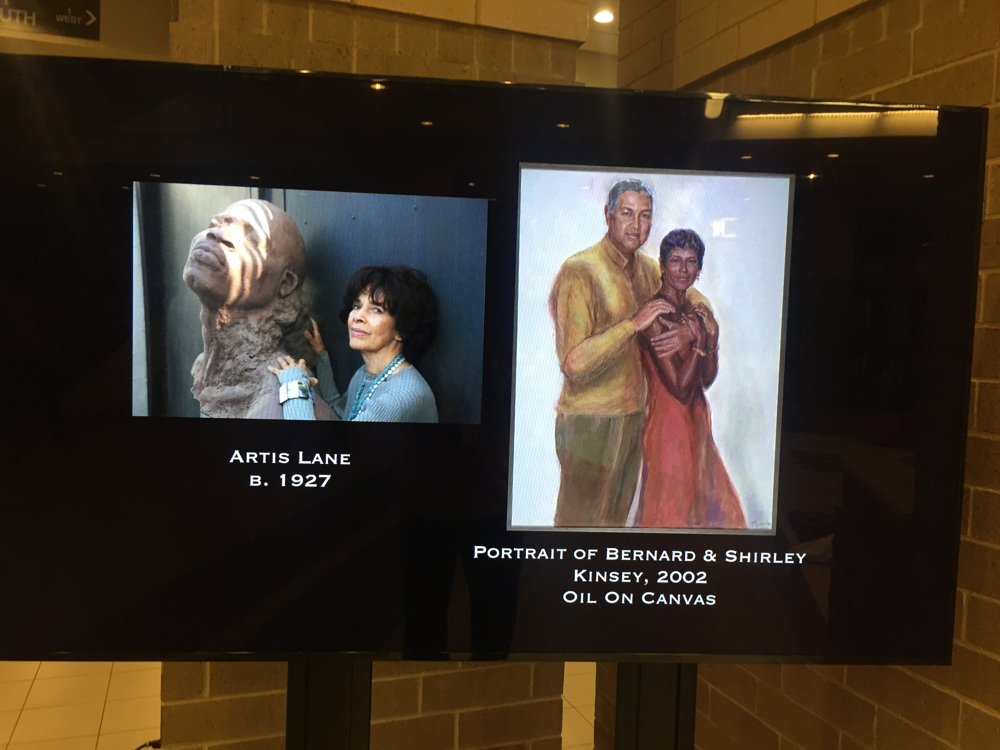
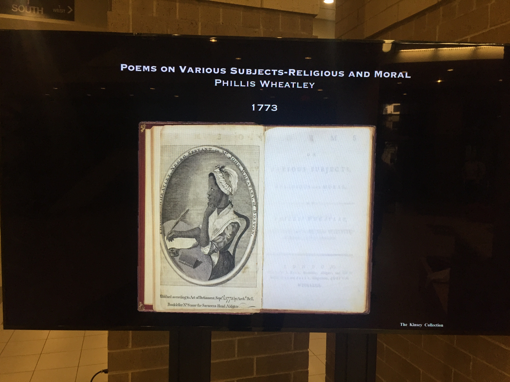
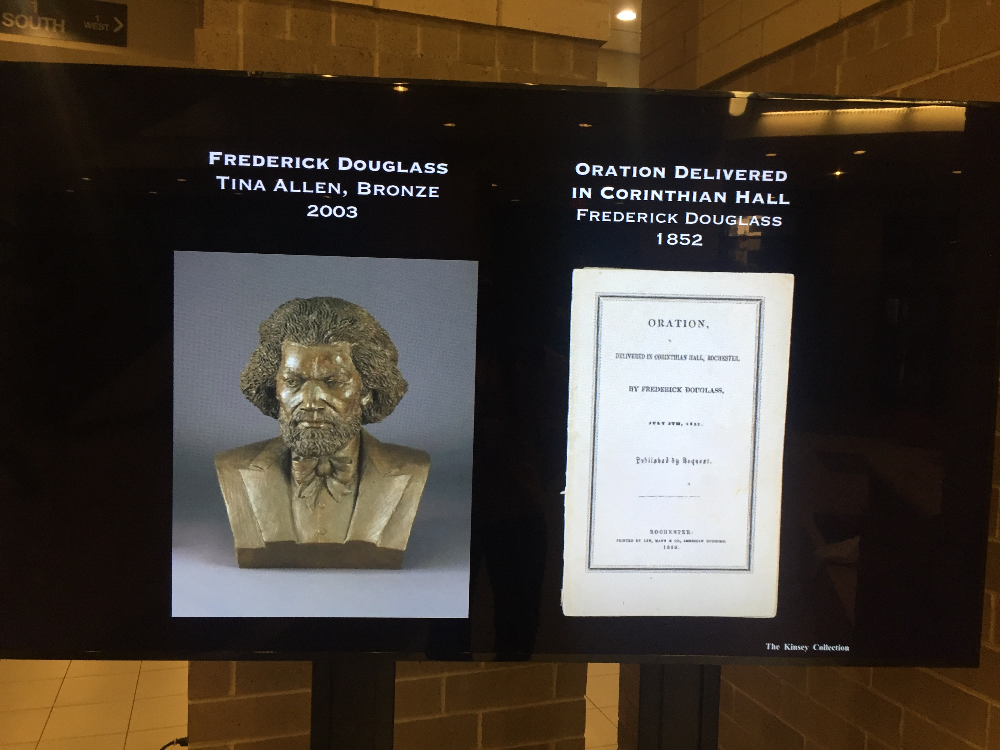

<!-- .slide: id="title" -->
# Diversity and Inclusion
&nbsp;
&nbsp;
&nbsp;

<!--s-->

### Wil Pannell

 

Agile Engineering Coach working with Jason Hobbs <!-- .element: class="fragment" -->

&nbsp;
&nbsp;
&nbsp;

Note: whoami? working with? what I do?

<!--s-->

# Preface

&nbsp;

Psychological Safety <!-- .element: class="fragment" -->

&nbsp;

Note: safety is a theme in DevOps culture. how david made me feel safe

<!--s-->

<!-- .slide: data-background="resources/hussman.png"  data-background-size="contain" -->

Note: the late David Hussman story

<!--s-->

<!-- .slide: data-background="resources/hussman-prod-conf.png"  data-background-size="contain" -->

Note: David at product conference in 2017

<!--s-->

<!-- .slide: data-background="resources/david and jez.png"  data-background-size="contain" -->

Note: Jez was there, too. David offered me my first speaking engagement. Cool. 

<!--s-->

<!-- .slide: data-background="resources/john-willis.jpeg"  data-background-size="contain" -->

Note: when I got there, BOOM! I found out I was slotted on the main stage right in between John Willis 

<!--s-->

<!-- .slide: data-background="resources/mary poppendieck.png"  data-background-size="contain" -->

Note: and my idol, Mary Poppendieck. so that's what stage fright feels like

<!--s-->

<!-- .slide: data-background="resources/hussman.png"  data-background-size="contain" -->

Note: I worked feverishly until 15 minutes before my slot. david: what, you don't feel safe? 

<!--s-->

<!-- .slide: data-background="resources/jez.png"  data-background-size="contain" -->

Note: Jez is mentoring me the same way here. Think big, start small. Limit blast radius. 

<!--s-->

### Make People Awesome 

 

&nbsp;
&nbsp;
&nbsp;

Note: back to me: what I value? groom lean and agile leads, teams and organizations

<!--s-->

<!-- .slide: data-background="resources/julio.png"  data-background-size="contain" -->

Note: in the past year, I've had the pleasure to help groom 3 new tech leads: Julio

<!--s-->

<!-- .slide: data-background="resources/pei.png"  data-background-size="contain" -->

Note: Pei

<!--s-->

<!-- .slide: data-background="resources/omeed.png"  data-background-size="contain" -->

Note: Omeed

<!--s-->

<!-- .slide: data-background="resources/lynn.jpg"  data-background-size="contain" -->

Note: this year now working on my fourth: Lynn

<!--s-->

<!-- .slide: data-background="resources/portal.jpeg"  data-background-size="contain" -->

Note: I coached one successful product (rescue): GDPR

<!--s-->

<!-- .slide: data-background="resources/seats.jpeg"  data-background-size="contain" -->

Note: the new seats product organization

<!--s-->

# Diversity and Inclusion
&nbsp;
&nbsp;
&nbsp;

Note: Back to the topic at hand. From my perspective, I could entitled this ...

<!--s-->

# ~~Di~~&nbsp;Adversity and ~~In~~&nbsp;Exclusion

(present company excepted) <!-- .element: class="fragment" -->

Note: I except AA because it is singularly the most diverse workplace I've ever enjoyed

<!--s-->

<!-- .slide: data-background="resources/portal.jpeg"  data-background-size="contain" -->

Note: there has never been a hint of typical corporate bias: look at my diverse portal team

<!--s-->

<!-- .slide: data-background="resources/seats.jpeg"  data-background-size="contain" -->

Note: and my new seats product team ... and then: holly

<!--s-->

<!-- .slide: data-background="resources/holly.png"  data-background-size="contain" -->

Note: in all my life I never met any black folk who don't react this way

<!--s-->

<!-- .slide: data-background="resources/gdpr-leadership.png"  data-background-size="contain" -->

Note: the GDPR product and program leadership

<!--s-->

## the seats product organization leadership

Mariana Fonseca <!-- .element: class="fragment" -->

Becky Sherman <!-- .element: class="fragment" -->

Kathy Bleikamp <!-- .element: class="fragment" -->

(Anna Torres) <!-- .element: class="fragment" -->

Note: the seats product organization leadership (trying to get Anna to coach)

<!--s-->

# MLK Day

Note: first enterprise I've worked where we've taken off MLK day

<!--s-->

#### This is what's playing now in the HDQ2 Lobby ...

 

... for Black History Month <!-- .element: class="fragment" -->

Note: black history month

<!--s-->

#### This is what's playing now in the HDQ2 Lobby ...

 

... for Black History Month

<!--s-->

#### This is what's playing now in the HDQ2 Lobby ...

 

... for Black History Month

<!--s-->

#### This is what's playing now in the HDQ2 Lobby ...

 

... for Black History Month

<!--s-->

#### This is what's playing now in the HDQ2 Lobby ...

 

... for Black History Month

Note: black history month

<!--s-->

#### This is what's playing now in the HDQ2 Lobby ...

 

... for Black History Month

Note: Now,I find these observations encouraging and rewarding ...

<!--s-->

#### This is what's playing now in the HDQ2 Lobby ...

 

... for Black History Month

Note:  ... but somebody dismissed this attributing them as a response to some 
high-profile bias incidents. 

<!--s-->

#### This is what's playing now in the HDQ2 Lobby ...

 

... for Black History Month

Note: My response. Incidences of bias matter, but how you respond to and 
learn from them matter infinitely more. 

<!--s-->

# ~~Di~~&nbsp;Adversity and ~~In~~&nbsp;Exclusion

(so, present company excepted)

Note: now, let's drill down to adversity and exclusion

<!--s-->

# Adversity and Exclusion

&nbsp;

Note: typically, what we mean by D&I is with respect to exclusively gender

<!--s-->

<!-- .slide: data-background="resources/gdpr-leadership.png"  data-background-size="contain" -->

Note: I'm thrilled by this gender diversity ...

<!--s-->

## the seats product organization leadership

Mariana Fonseca <!-- .element: class="fragment" -->

Becky Sherman <!-- .element: class="fragment" -->

Kathy Bleikamp <!-- .element: class="fragment" -->

(Anna Torres) <!-- .element: class="fragment" -->

Note: ... and this

<!--s-->

<!-- .slide: data-background="resources/rachel.png"  data-background-size="contain" -->

Note: me tweeting about my first majority women engineering meeting

<!--s-->

<!-- .slide: data-background="resources/garage-leadership-meeting.jpg"  data-background-size="contain" -->

Note: my first garage education leadership meeting

<!--s-->

# Adversity and Exclusion

&nbsp;

Note: the irony of D&I is that it excludes entertaining 
racial, ethnic and LGBT diversity?

<!--s-->

<!-- .slide: data-background="resources/martin1.png"  data-background-size="contain" -->

Note: I asked Martin Fowler once ...

<!--s-->

<!-- .slide: data-background="resources/martin2.png"  data-background-size="contain" -->

Note: his dismissal of racial, ethnic and LGBT diversity was casual, at best

<!--s-->

# Adversity and Exclusion

is real <!-- .element: class="fragment" -->

is racial <!-- .element: class="fragment" -->

&nbsp;

<!--s-->

in my org I am the only black engineer

(3.5 years and running) <!-- .element: class="fragment" -->

in my career I've only once not been the only black engineer <!-- .element: class="fragment" -->

&nbsp;

Note: what do I do about it? I take mentoring seriously

<!--s-->

<!-- .slide: data-background="resources/jamon.jpeg"  data-background-size="contain" -->

Note: that time I worked with another black engineer, I hired him myself ... 
it was my singular gratification when twice I recommended him to his new jobs

<!--s-->

<!-- .slide: data-background="resources/monq.png"  data-background-size="contain" -->

Note: I worked evenings and weekend mornings with monq and sent him to IL

<!--s-->

# Adversity and Exclusion

is real <!-- .element: class="fragment" -->

is racial <!-- .element: class="fragment" -->

is many-fold worse for black women engineers <!-- .element: class="fragment" -->

the forces arrayed against Diversity and Inclusion are daunting <!-- .element: class="fragment" -->

&nbsp;

<!--s-->

<!-- .slide: data-background="resources/cornell.png"  data-background-size="contain" -->

Note: the irony of my cornell story was I did it out or spite, and dropped out after the first year

<!--s-->

## Why Black Folk aren't hired

<video class="stretch" controls="controls" data-autoplay src="resources/Would you want to be treated like blacks.mp4"></audio>

&nbsp;

_**(Jane Elliott: anti-racism experiment circa 1972) **_ <!-- .element: style="color:maroon; font-size: .5em" -->

<!--s-->

# Adversity and Exclusion

what we can do about it is kinda simple

mentor more black folk <!-- .element: class="fragment" -->

hire more black folk <!-- .element: class="fragment" -->

&nbsp;

<!--s-->

## How to Hire Black Folk

&nbsp;

<audio controls="controls" data-autoplay src="resources/podcast.mp3"></audio>

&nbsp;

_**(interview: geek joy podcast circa 2016) **_ <!-- .element: style="color:maroon; font-size: .5em" -->

<!--s-->

# Adversity and Exclusion

as a final note ... <!-- .element: class="fragment" -->

... among the strongest voices in tech today ... <!-- .element: class="fragment" -->

... for real Diversity and Inclusion <!-- .element: class="fragment" -->

(follow him on twitter to see for yourself) <!-- .element: class="fragment" -->

&nbsp;

<!--s-->

<!-- .slide: data-background="resources/jez.png"  data-background-size="contain" -->

